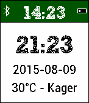

# Timezones-Pebble-Watchface
This Repository hosts my own adaption of the Pebble Tutorial for a Watchface

## Features
- local time, date and weather is displayed
- time of a second timezone is displayed
-- As I have not found a nice way to configure the app without hosting the configuration page, the timezone_offset is compiled in
- indicator, if battery goes below 20%
- indicator and vibration, if bluetooth connection to the phone is lost

## Example
